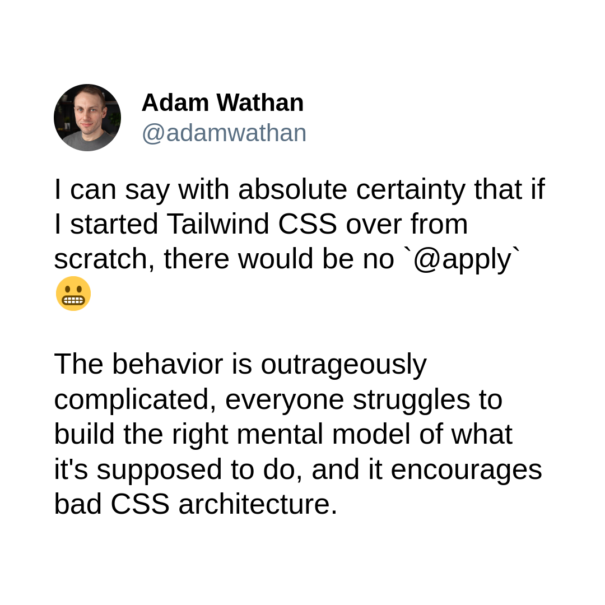

import { Callout, Steps } from 'nextra/components'
import {Red} from '../Text'


# 8 Months Of Waste?
Would you like to know the <ins>time and effort</ins> that was wasted by the
devs who created `tailwindcss.com`.

As the creators of `Tailwind CSS`, they could serve as a benchmark for other
developers using Tailwind CSS. If we uncover inefficiencies here, it could
suggest even greater inefficiencies among less experienced Tailwind users.

Let's scan their source code using Klassco

<Steps>
### Get the source code of `tailwindcss.com`

```bash
$ git clone https://github.com/tailwindlabs/tailwindcss.com
$ cd tailwindcss.com
```

### Scan the `src` folder

```bash {4}
$ klassco -m 7 -t src

---
67020 duplicates so far...
```
</Steps>

**Sixty seven thousand duplicates** and counting. This scan only accounted for
duplicates of length 7 `-m 7`, excluding duplicates of lengths 2, 3, 4, and so
on.

Can you imagine the total if we included those? Half a million? A million?
**Neither would surprise me**.


<br />
## The Hidden Cost
Consider this class combination:

```js
className="p-6 max-w-sm mx-auto bg-white rounded-xl shadow-md flex items-center space-x-4"
```

It takes time to decipher each class and understand their collective purpose.
Even then, the overall context remains unclear.

To modify this combination, one must understand how each class interacts, make
the necessary changes, and then verify the result. This process repeats until
the desired outcome is achieved.

Realistacally the time it takes to create a 7-class combination can range
from 1 to 15 minutes, and that's assuming no bugs. Revisiting the component
later requires the same mental overhead to recall the purpose of each class.

If we conservatively estimate just 5 minutes per combination, the time wasted
on our preliminary scan alone equates to nearly 8 months. **What's worse, this
time and effort will be wasted again in the next project, and the next, and
the next.**

If you are unhappy with the 5-minute time limit per combination, note
that I have only accounted for duplicates of length 7. The total waste across
all lengths is staggering.


<br />
## DRY
If we had abstracted these classes into higher-level utilities, we could have
avoided this mental overhead.

```js
className={`${modern("wrapper")} center-x`}
```

This immediately informs us that we have a modernized wrapper aligned along
the x-axis.

In this example, the `modern()` utility is smart enough to give a modern look
to wherever type was given to it (input, form, div, wrapper) and incorporate
rounded corners, shadows, hover effects, active states, and more, tailored to
the specific type.

The `center` utility efficiently manages centering, adapting seamlessly to
various contexts like flexbox, block, or grid layouts.

These example utilities abstract away cumbersome low-level details, sparing us
the need to delve into intricacies.

If I wish to center something, I should simply use the 'center' utility – no
need to consider the display type, whether it's flexbox, the direction (column
or row), or whether to use justify-content or align-items.

**This eliminates unnecessary time wastage.**


<br />
## The Failure


TailwindCSS, Windi CSS, and UnoCSS are all examples of CSS frameworks that
provide low-level utilities and lack the ability to build higher-level
abstractions.

While UI kits like ChakraUI, ShadcnUI, and NextUI may seem like a higher
abstraction, they are only acceptable <Red text="if you make zero
customizations to them" />, but as soon as you start using CSS to modify each
component to your need and liking, you are back to square one.


**This is Why Klassco was born**.


<br />
## How Does Klassco Work?
It scans all of your HTML files, JavaScript components, and other
templates for class names to help you reuse styles and remove any duplicates.

Klassco uses mathematical combinations to thoroughly explore and analyze
**every imaginable combination** of your CSS classes, to help you identify
subtle patterns, spot redundancies, and create a carefully curated selection
of unique class combinations.

It solves the problem that front-end framework components cannot solve when it
comes to CSS.

**Klassco is designed to save you time and effor.**


## But, I don't use Tailwind
Tailwind was just an example, repetition is inevitable . As projects scale,
managing this repetition becomes increasingly challenging.

This is true for all methodologies, modular methodologies like BEM and atomic
approaches like Tailwind, where utility classes will lead to **extensive
redundancy**.


<br />
## Next Steps
The next step is understand how you can abstract and start building with
Klassco.

- [Why Klassco [&#8599;]](../core-concepts/why-klassco)
- [How to Abstract [&#8599;]](../core-concepts/how-to-abstract)
- [Installation [&#8599;]](../basic-usage/installation)
- [Quick Start [&#8599;]](../basic-usage/usage)
